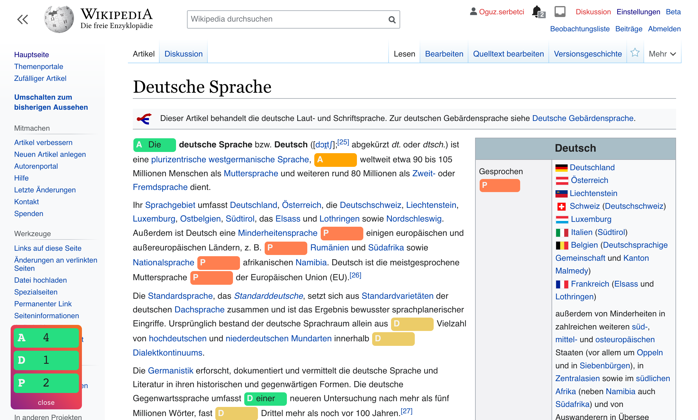

# blank
A chrome extension to practice language while reading on web.

Learning articles and propositions can be very boring, but no more!
Just try to guess them while reading on web while this extension tracks your score.

## Installation
Download `blank-*.xpi` from Releases and add it to firefox as a local extension.

## Setup
Go to extension preferences to add patterns to replace with blanks.
You can define multiple blank patterns. Each replaces words that match a regular expression in text.
If you are learning german, there are three default patterns you can load with a click of a button.
Otherwise follow the instructions below to create your own:

1. Write regular expression that matches **words** (not sub-words.)
> If you do not know regular expressions you can simply replace words from a list with `(der|die|das)`, which matches and replaces `der`, `die` and `das` with blanks.
2. You can define a short descriptive marker to easily identify the blank type, e.g. A for articles der, die, das.
3. Select a color for the blank to easily distinguish it from other type of blanks.

You can activate and deactivate patterns using the checkbox in the beginning of each row.

## Usage
Click the plugin icon on the address bar to activate blanks on the currently open tab.
Now each paragraph has a randomly assigned blank type so that you do not get too distracted.

> If you want more blanks, just click the icon again!

On the bottom left corner you can track your score or close the extension for the tab.

## Compatibility 
Only works with Firefox. I am open to PRs that would make it work on other browsers :)
